# Real-time Event Driven Decisions with Amazon MSK and Amazon Redshift Streaming

## 📌 Project Overview
This project demonstrates how to build a **real-time event-driven decision-making solution** using **Amazon MSK (Managed Streaming for Apache Kafka)** and **Amazon Redshift Streaming**.  

The use case is **Flu Outbreak Monitoring** — simulating how hospitals can track outbreaks and patient admissions in real time to make informed decisions.  

Through this project, I practiced:  
- Streaming data ingestion with **Amazon MSK**  
- Running real-time analytics using **Amazon Redshift Streaming**  
- Loading reference data from **Amazon S3 to Redshift**  
- Executing SQL queries to extract insights  

---

## 🏗 Architecture
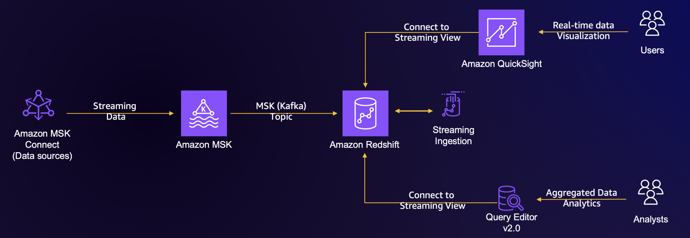

**Workflow:**
1. Streaming data is generated and sent to **Amazon MSK**.  
2. MSK topics stream data into **Amazon Redshift**.  
3. **Materialized Views** in Redshift provide real-time analytics.  
4. Analysts can query results using **Redshift Query Editor v2**.  
5. (Optional) Visualization with Amazon QuickSight.  

---

## ⚙️ Technologies Used
- **Amazon MSK (Kafka)** – Data streaming  
- **Amazon MSK Connect** – Ingestion from custom plugin  
- **Amazon Redshift Streaming** – Real-time analytics engine  
- **Amazon S3** – Reference data (hospital facilities)  
- **AWS CloudFormation** – Automated environment setup  
- **Amazon IAM** – Role-based access  

---

## 🚀 Implementation Steps

### 1. Environment Setup with CloudFormation
Deployed the stack that provisioned MSK Cluster, Redshift Cluster, IAM roles, and networking.  

  
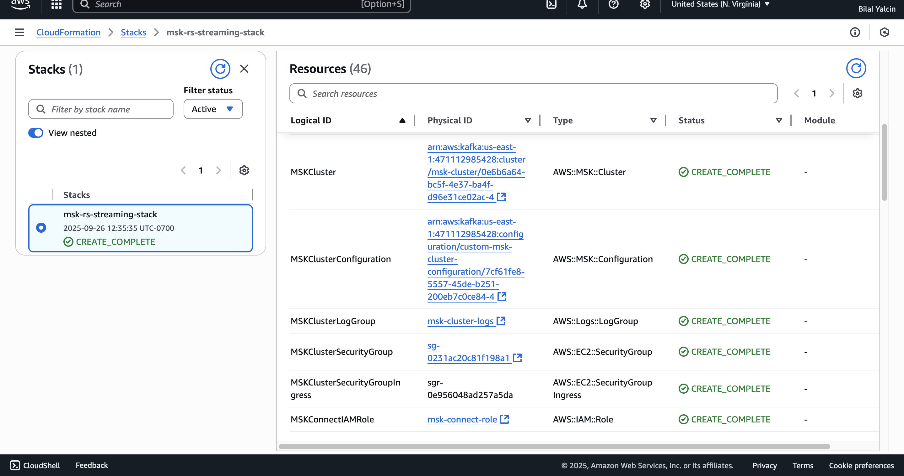  
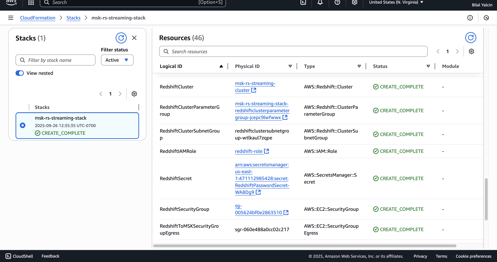  

---

### 2. MSK Cluster and Plugin Setup
Created the Kafka cluster and a custom plugin for data generation.  

  
  
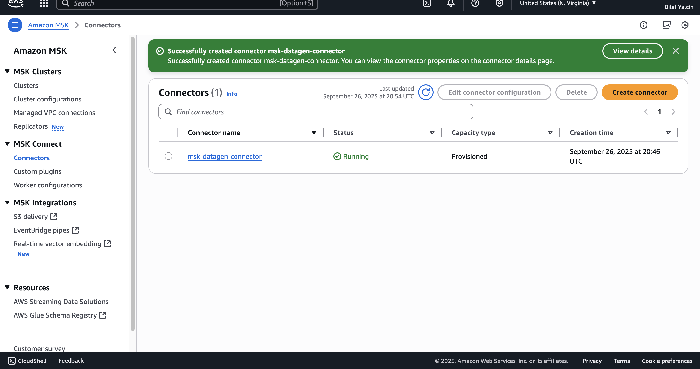  

---

### 3. Redshift Cluster Setup
Redshift cluster was provisioned and made available for streaming ingestion.  

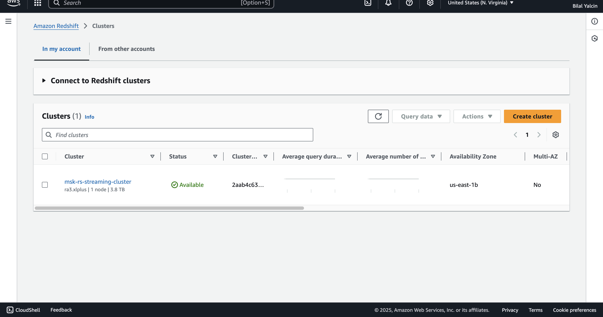  

---

### 4. Schema & Materialized View
Created an external schema and materialized view to process streaming data.  

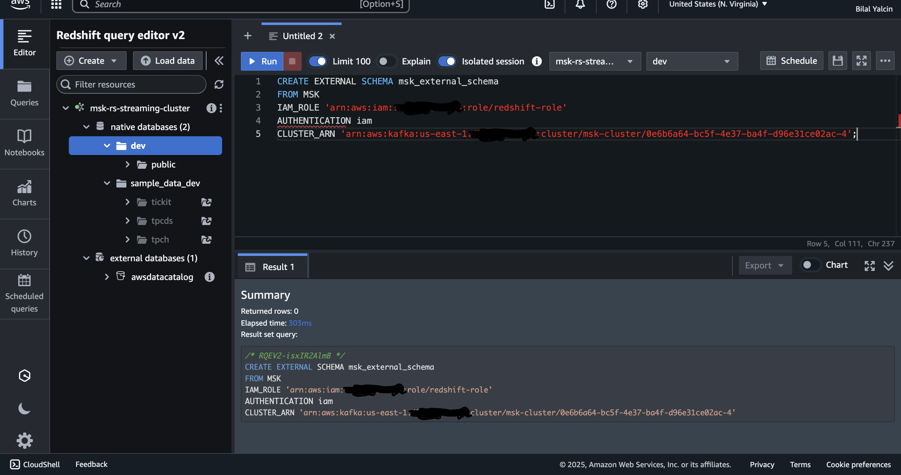  
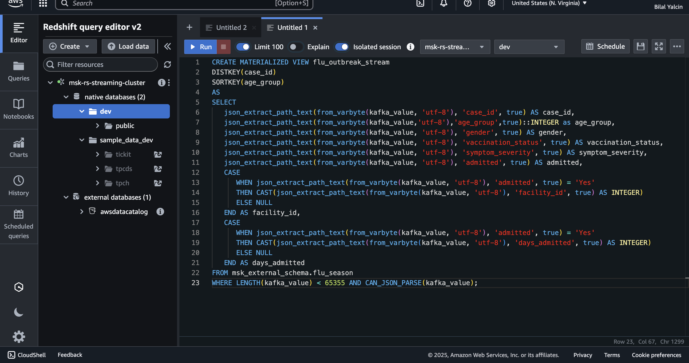  

---

### 5. Load Reference Data (Hospital Facilities)
Loaded hospital metadata from S3 into Redshift.  

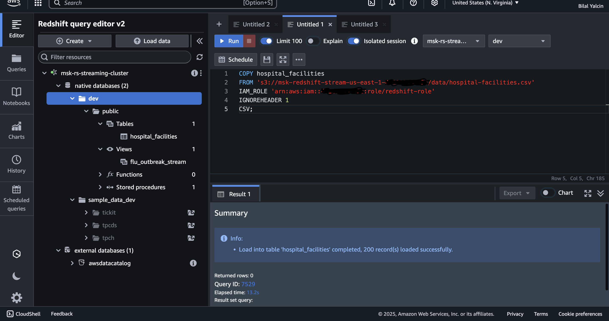  

---

### 6. Streaming Analytics Queries

#### Sample query – streaming data check:
```sql
SELECT * FROM flu_outbreak_stream LIMIT 10;
```
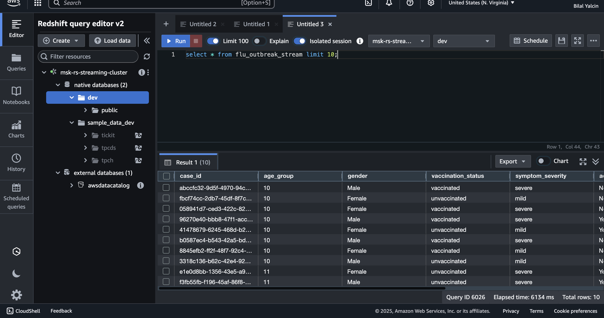  

#### Aggregated cases by severity:
```sql
SELECT age_group, symptom_severity, COUNT(case_id) AS total_cases
FROM flu_outbreak_stream
WHERE symptom_severity = 'severe'
GROUP BY age_group, symptom_severity
ORDER BY total_cases DESC;
```
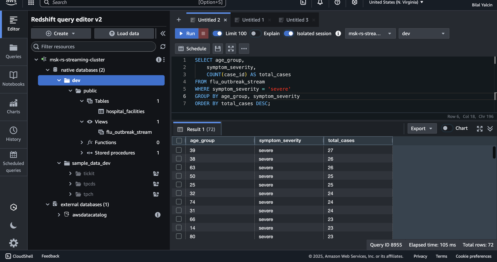  

#### Hospitalization rate by age group:
```sql
SELECT age_group,
       COUNT(case_id) AS total_cases,
       SUM(CASE WHEN admitted = 'Yes' THEN 1 ELSE 0 END) AS hospitalized_cases,
       ROUND(SUM(CASE WHEN admitted = 'Yes' THEN 1 ELSE 0 END) * 100.0 / COUNT(case_id), 2) AS hospitalization_rate
FROM flu_outbreak_stream
GROUP BY age_group
ORDER BY hospitalization_rate DESC;
```
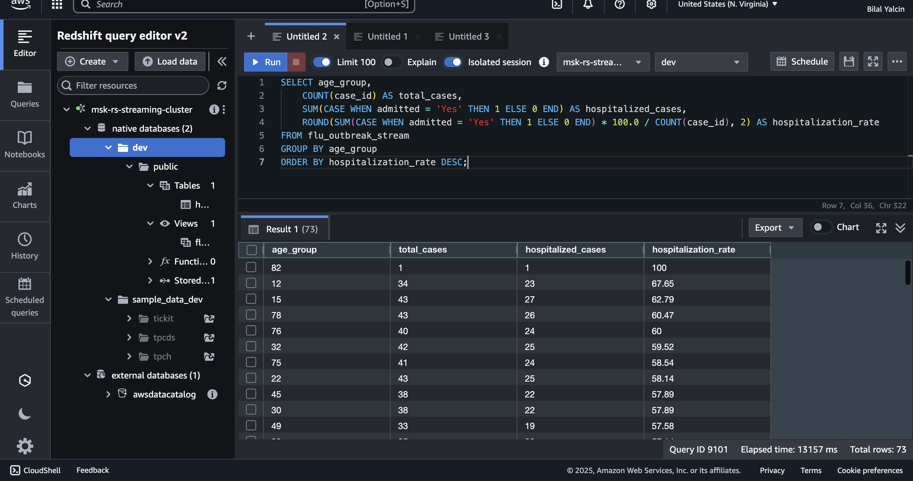  

#### Top hospitals by total cases:
```sql
SELECT hf.name_of_facility, hf.location_id, hf.zipcode, hf.latitude, hf.longitude,
       COUNT(f.case_id) AS total_cases
FROM flu_outbreak_stream f
JOIN hospital_facilities hf ON f.facility_id = hf.location_id
GROUP BY hf.name_of_facility, hf.location_id, hf.zipcode, hf.latitude, hf.longitude
ORDER BY total_cases DESC
LIMIT 10;
```
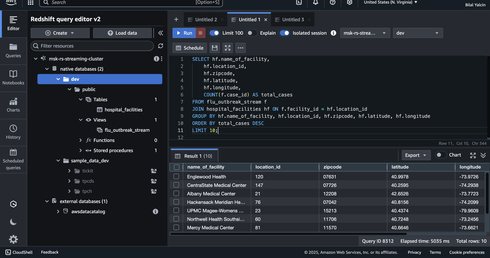  

---

## 📊 Results & Insights
- Identified **highest hospitalization rates by age group**.  
- Found **top hospitals with most admissions**.  
- Detected patterns of **severe cases by age**.  

---

## 🧹 Cleanup
To avoid unnecessary AWS charges, delete the following:  
- CloudFormation stack (`msk-rs-streaming-stack`)  
- Amazon MSK Cluster, Connector, and Plugin  
- Amazon Redshift Cluster  
- Any IAM roles created for this project  

---

## 📖 How to Reproduce
1. Deploy the provided **CloudFormation template**.  
2. Set up **MSK Plugin + Connector**.  
3. Verify data streaming into **Redshift Streaming**.  
4. Run SQL queries in **Query Editor v2**.  
5. (Optional) Connect to **QuickSight** for visualization.  

---

✅ This project gave me hands-on experience with **real-time analytics pipelines** in AWS using MSK + Redshift Streaming.  
